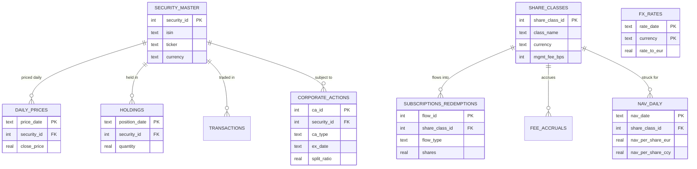

# NAV calculation engine

A working fund accounting system, scaled down. It keeps a EUR denominated fund
with two share classes in a SQLite database, strikes a NAV per share every
business day from prices, FX rates, fees and corporate actions, then runs a
separate oversight pass that produces a daily exceptions report. Next to the
liquid fund sits a private equity sleeve, valued quarterly, with carry worked
out through a distribution waterfall.

The data is synthetic and the repo generates it, so a fresh clone runs end to
end with one command. Five errors are planted in that data on purpose. Finding
them is the reconciliation layer's job.

## Why SQLite and no dependencies

SQLite is one file with no server to set up, so anyone can clone this and run
it. Everything the project needs is in the Python standard library, `sqlite3`
included, so there is nothing to install. It also copes with every SQL feature
used here, window functions and all.

A real administrator would put this on Postgres, SQL Server or Oracle instead,
for concurrency, access control and an audit trail. None of that matters for a
demo running on one machine.

## The problem

Every business day a fund administrator has to answer one question per share
class: what is a single share worth?

Getting to that number means valuing each holding at market, converting it into
the fund's base currency, accruing fees, processing corporate actions, and
allowing for the day's subscriptions and redemptions. Then somebody independent
has to check the answer before it goes out. A NAV that is wrong is a reportable
error. So is a NAV that happens to be right but was never checked.

This repo models that daily cycle for a EUR fund with two share classes. The
PE sleeve runs on a quarterly cycle instead and is covered in its own section.

## Data model

Reference data is kept apart from time series data. Reference data barely
changes: what a security is, what a share class is. Time series data is dated to
a particular day: prices, FX rates, positions, flows. Each fact is stored once
and joined when it is needed, so a price lives in `daily_prices` and never gets
copied onto a holding row. Everything points back to `security_master` or
`share_classes` by id.



`transactions` and `fee_accruals` are left out of the picture to keep it
readable. They follow the same pattern. The PE sleeve's tables are in
`sql/04_pe_sleeve.sql`.

## How the NAV is struck

Valuation runs in SQL, in `sql/02_nav_calculation.sql`. It is a set operation:
join every holding to its price and its FX rate, multiply, sum.

```
market value (EUR) = sum of  quantity * close_price * rate_to_eur
```

The per class accounting runs in Python, in `src/calculate_nav.py`, because each
day depends on the day before and SQL is awkward at that. For every NAV date and
share class:

1. net assets grow with the return on the shared portfolio
2. the class takes its pro rata share of any dividend income
3. the class accrues its own management fee, actual/365, which reduces NAV
4. NAV per share is struck on pre-deal net assets divided by pre-deal shares
5. subscriptions and redemptions are dealt at that struck NAV, which moves shares
   outstanding but not the published NAV (forward pricing)
6. NAV per share is converted into the class currency

The two classes sit on the same portfolio and still drift apart, because their
fees, currencies and investor flows are different. EUR Acc charges 75 bps and
accumulates. USD Dist charges 150 bps and distributes.

Things left out on purpose: the fund is fully invested at inception and never
trades again, there is one pricing point a day, and there is no income
equalisation and no tax. Steps 1 to 6 could be pushed into pure SQL with a
recursive CTE.

## The PE sleeve

The sleeve is a separate book under the same umbrella as the liquid fund. It
has its own deals and investors and strikes its own NAV, so it is not a share
class. Share classes all own the same portfolio. The sleeve doesn't.

It is closed-end. Investors commit 5.0m EUR, the manager calls it as deals
come up (three calls, 4.5m in total) and pays cash back when a deal is sold.
The sleeve keeps units so it can report a NAV per unit like the liquid fund. A
call issues units at that quarter's NAV. A distribution pays cash out and
leaves the units alone, so NAV per unit drops. Plenty of closed-end funds keep
partner capital accounts instead.

The liquid fund's data only covers January 2024. A waterfall needs a few years
of calls and exits before it has anything to show, so the sleeve runs from Q1
2024 to Q2 2026 and is valued at each quarter end from a manager mark. On each
of those dates `src/pe_sleeve.py` charges the 150 bps management fee, accrues
carry, and then deals that day's calls and distributions.

Carry goes through the waterfall in `src/waterfall.py`:

| Tier | Who gets it |
|---|---|
| `RETURN_OF_CAPITAL` | LPs, until their called capital is back |
| `PREFERRED_RETURN` | LPs, until they have 8% a year on it, compounded |
| `CATCHUP` | the GP, until it holds 20% of the profit paid out so far |
| `CARRY` | 80% to LPs and 20% to the GP from then on |

Between sales, carry is accrued on a hypothetical liquidation basis (HLBV).
The engine runs the waterfall as if the sleeve sold everything at the mark,
and the GP's share goes on the books as a liability. Nobody has been paid it,
but it still comes off the NAV investors see. By the end of June 2026 there is
22k EUR of carry accrued and none paid, since both sales so far only returned
capital.

After two exits NAV per unit is down to 24.43, which on its own says little
about how the sleeve has done. The figures people look at are DPI,
the cash LPs have had back per euro called (0.89x), and TVPI, which adds what
they still hold at NAV (1.13x). Both are net of fees and accrued carry, and
`run.py` prints them for every quarter.

The sleeve uses a European waterfall, with one set of tiers for the whole
sleeve. An American waterfall runs the tiers deal by deal, and on this data the
difference is easy to see. Deal A was sold for 1.8m against 2.0m called, so it
lost money. Deal B was sold for 2.2m against 1.5m called. Deal by deal, the GP
would already have been paid 140k EUR of carry on deal B, loss on deal A or
not. The European waterfall hasn't paid anything yet. If the sleeve were wound
up at today's marks, the GP would owe 118k EUR of that back, which is the
situation a clawback clause is written for. `waterfall.clawback()` works out
that exposure.

Left out: management fees counting as contributed capital, fee offsets against
carry, recycling of proceeds and tax distributions. The sleeve has no cash
account either, so the mark is assumed to include any cash it holds.

## The exceptions layer

`src/reconciliation.py` runs seven checks over the finished NAV and writes what it
finds to the `exceptions` table.

| Check | What it catches |
|---|---|
| `STALE_PRICE` | a price repeated across 3 or more consecutive days, so a dead feed |
| `MISSING_PRICE` | a security held on a NAV date with no price against it |
| `UNRECORDED_CORP_ACTION` | a large one-day drop with no corporate action booked, which usually means an unbooked split |
| `PRICE_OUTLIER` | a one-day move past a hard threshold, so a fat finger |
| `NAV_MOVE_TOLERANCE` | fund value moving more than tolerance day over day |
| `NAV_CALC_BREAK` | the stored NAV disagreeing with a recompute written separately from the engine |
| `PE_SLEEVE_BREAK` | a sleeve NAV that doesn't tie back to the mark, fee, carry and cash, carry that doesn't match a fresh waterfall run, or calls above the commitment |

Watch what a single bad price does in the output below. The AAPL fat finger on
the 17th trips the outlier check that day, then trips the corporate action check
on the 18th when the price reverts and the fall looks like a split, and drags the
fund level move check over tolerance on both days. Four flags, one cause. Real
exceptions reports read like that, and the work is figuring out which flag is the
actual problem and which ones are just downstream of it.

### Sample output

```
==============================================================================
  DAILY EXCEPTIONS REPORT   run YYYY-MM-DD   10 exception(s)
==============================================================================
[HIGH  ] MISSING_PRICE          NESN
          held on 2024-01-22 but no price in daily_prices
[HIGH  ] PRICE_OUTLIER          AAPL
          one-day price move of +892.1% on 2024-01-17 exceeds 30% threshold (possible fat-finger)
[HIGH  ] UNRECORDED_CORP_ACTION AAPL
          price fell -90.0% on 2024-01-18 with no corporate action booked (looks like an unrecorded split)
[HIGH  ] UNRECORDED_CORP_ACTION NOVOB
          price fell -49.5% on 2024-01-24 with no corporate action booked (looks like an unrecorded split)
[HIGH  ] NAV_CALC_BREAK         EUR Acc
          stored NAV 100.1556 EUR on 2024-01-29 vs independent recompute 98.1918 EUR (break +1.9638)
[MEDIUM] STALE_PRICE            SAP
          price 141.23 unchanged for 6 business days (2024-01-12..2024-01-19)
[MEDIUM] NAV_MOVE_TOLERANCE     Fund GAV
          gross asset value moved +143.6% on 2024-01-17 (tolerance +/-3%)
[MEDIUM] NAV_MOVE_TOLERANCE     Fund GAV
          gross asset value moved -58.9% on 2024-01-18 (tolerance +/-3%)
[MEDIUM] NAV_MOVE_TOLERANCE     Fund GAV
          gross asset value moved -12.8% on 2024-01-22 (tolerance +/-3%)
[MEDIUM] NAV_MOVE_TOLERANCE     Fund GAV
          gross asset value moved +14.5% on 2024-01-23 (tolerance +/-3%)
==============================================================================
```

The run is deterministic. The random seed is fixed, so your numbers will match
these.

## Running it

There is nothing to install. Python 3.8 or newer is enough.

```bash
git clone https://github.com/sasmitha-jayakody/nav-engine.git
cd nav-engine
python run.py
```

That builds the database, strikes the NAV and prints the exceptions report. On
Windows, use `py run.py` if `python` is not on your path.

The tests run the whole pipeline against a scratch copy of the database:

```bash
python -m unittest discover tests
```

To dig into the data, open `data/nav.db` in
[DB Browser for SQLite](https://sqlitebrowser.org) and work through
`sql/03_sample_queries.sql` from the top. Those queries start at a plain SELECT
and end at window functions, following the same path the engine takes.

## Layout

```
nav-engine/
├── README.md
├── requirements.txt
├── run.py                      # one command: generate, strike NAV, reconcile
├── sql/
│   ├── 01_schema.sql           # tables, keys, foreign keys
│   ├── 02_nav_calculation.sql  # valuation views (JOIN, GROUP BY, window fns)
│   ├── 03_sample_queries.sql   # guided SQL tour, easy to advanced
│   └── 04_pe_sleeve.sql        # PE sleeve tables
├── src/
│   ├── generate_data.py        # synthetic data and the planted errors
│   ├── calculate_nav.py        # per class daily NAV roll forward
│   ├── pe_sleeve.py            # quarterly NAV and carry for the PE sleeve
│   ├── waterfall.py            # the distribution waterfall
│   └── reconciliation.py       # the exceptions layer
├── tests/
└── data/                       # nav.db is written here and git-ignored
```

## What is missing for production

Decimal or fixed point money instead of floats, so rounding cannot move the NAV.
More than one price source, with a hierarchy for choosing between them. Income
equalisation, tax and withholding. Swing pricing. A server database with an audit
trail and four eyes sign off before a NAV is published. A scheduler. For the PE
sleeve, a cash account and an investor register.

All of that is real work. None of it changes the accounting in the middle, which
is the part this repo is about.
