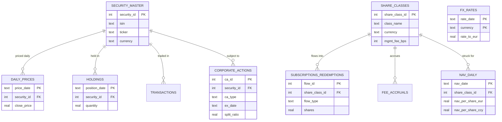

# NAV calculation engine

A working fund accounting system, scaled down. It keeps a EUR denominated
hybrid fund in a SQLite database: two open-ended, hedge/mutual-fund-style
share classes struck at a daily NAV, and a PE-style share class dealt via
capital calls and distributions with carried interest paid through a
waterfall. It strikes a NAV per share every business day from prices, FX
rates, fees and corporate actions, then runs a separate oversight pass that
produces a daily exceptions report.

The data is synthetic and the repo generates it, so a fresh clone runs end to
end with one command. Five errors are planted in that data on purpose. Finding
them is the reconciliation layer's job.

## Why SQLite and no dependencies

SQLite is one file with no server to set up, so anyone can clone this and run
it. Everything the project needs is in the Python standard library, `sqlite3`
included, so there is nothing to install. It also copes with every SQL feature
used here, window functions and all.

A real administrator would put this on Postgres, SQL Server or Oracle instead,
for concurrency, access control and an audit trail. None of that matters for a
demo running on one machine.

## The problem

Every business day a fund administrator has to answer one question per share
class: what is a single share worth?

Getting to that number means valuing each holding at market, converting it into
the fund's base currency, accruing fees, processing corporate actions, and
allowing for the day's subscriptions and redemptions. Then somebody independent
has to check the answer before it goes out. A NAV that is wrong is a reportable
error. So is a NAV that happens to be right but was never checked.

This repo models that daily cycle for a EUR fund with three share classes:
two open-ended (EUR Acc, USD Dist) and one PE-style (PE Sleeve). A hybrid
fund of this kind -- one vehicle holding both a daily-priced liquid book and
an illiquid, periodically-marked one -- is increasingly how the market
actually structures things, and it needs different plumbing for how investors
deal and how the manager gets paid. See "Hybrid fund: the PE Sleeve and its
waterfall" below.

## Data model

Reference data is kept apart from time series data. Reference data barely
changes: what a security is, what a share class is. Time series data is dated to
a particular day: prices, FX rates, positions, flows. Each fact is stored once
and joined when it is needed, so a price lives in `daily_prices` and never gets
copied onto a holding row. Everything points back to `security_master` or
`share_classes` by id.



`transactions` and `fee_accruals` are left out of the picture to keep it
readable. They follow the same pattern.

The PE Sleeve's own tables (`capital_commitments`, `waterfall_config`,
`pe_sleeve_marks`, `capital_calls`, `distributions`, `waterfall_ledger`) live
in `sql/04_hybrid_waterfall.sql`, kept separate from the base schema above --
see "Hybrid fund: the PE Sleeve and its waterfall" below for what they do and
why they're additive rather than folded into this diagram.

## How the NAV is struck

Valuation runs in SQL, in `sql/02_nav_calculation.sql`. It is a set operation:
join every holding to its price and its FX rate, multiply, sum.

```
market value (EUR) = sum of  quantity * close_price * rate_to_eur
```

The per class accounting runs in Python, in `src/calculate_nav.py`, because each
day depends on the day before and SQL is awkward at that. For every NAV date and
share class:

1. net assets grow with the return on the shared portfolio
2. the class takes its pro rata share of any dividend income
3. the class accrues its own management fee, actual/365, which reduces NAV
4. NAV per share is struck on pre-deal net assets divided by pre-deal shares
5. subscriptions and redemptions are dealt at that struck NAV, which moves shares
   outstanding but not the published NAV (forward pricing)
6. NAV per share is converted into the class currency

The two classes sit on the same portfolio and still drift apart, because their
fees, currencies and investor flows are different. EUR Acc charges 75 bps and
accumulates. USD Dist charges 150 bps and distributes.

Things left out on purpose: the fund is fully invested at inception and never
trades again, there is one pricing point a day, and there is no income
equalisation and no tax. Steps 1 to 6 could be pushed into pure SQL with a
recursive CTE.

## Hybrid fund: the PE Sleeve and its waterfall

The two classes above are hedge/mutual-fund style: investors deal at a daily
struck NAV, and the manager charges a flat management fee. A PE-style vehicle
is structured differently on both counts, and this repo's third class (PE
Sleeve, `share_class_id = 3`) models it end to end:

* **Dealing.** Investors don't subscribe and redeem freely. They **commit**
  capital up front (`capital_commitments`), the manager draws it down over
  time via **capital calls** (`capital_calls`) as opportunities come up, and
  investors get cash back via **distributions** (`distributions`) as
  investments realize. A class only deals this way if it has a row in
  `waterfall_config` -- that row is what marks it as PE-style at all, nothing
  in `share_classes` itself changes.

* **Valuation.** The illiquid sleeve is marked by the manager periodically
  (`pe_sleeve_marks`, roughly weekly here), not priced daily like the equity
  book. It also does **not** participate in `v_fund_gav`. Folding capital-call
  cash straight into the shared GAV would make every class's day-over-day
  return jump on call days for reasons that have nothing to do with markets --
  the same problem performance measurement solves with Modified Dietz /
  time-weighted returns. Keeping the two sleeves' valuation separate sidesteps
  that without needing a full cash-flow-adjusted return calculation here.

* **Incentive fee.** Instead of a hedge-fund-style performance fee (X% of NAV
  appreciation above a high-water mark), carried interest is paid through a
  **waterfall**: every dollar that could move between LPs and the GP is tiered,
  in order --

  1. `RETURN_OF_CAPITAL` -- LPs get called capital back first, 100% to LP
  2. `PREFERRED_RETURN` -- LPs then earn a hurdle (8% here, compounded
     actual/365) on that capital, 100% to LP
  3. `GP_CATCHUP` -- the GP "catches up" until its cumulative share of
     (preferred return + catch-up) hits the carry percentage
  4. `CARRY_SPLIT` -- everything after that splits 80/20 between LP and GP,
     uncapped

  This lives in `src/waterfall.py`, independent of the database, and supports
  both textbook pooling modes: **EUROPEAN** (whole-fund -- every call and
  distribution across the fund's life shares one pool of tiers, so the GP
  can't reach carry until *all* called capital plus its preferred return has
  come back, fund-wide) and **AMERICAN** (deal-by-deal -- each investment gets
  its own tier stack via a `deal_id` tag, so a profitable early deal can pay
  the GP carry while a later one is still underwater). The PE Sleeve here runs
  EUROPEAN, the LP-friendlier and currently more common choice; the repo's
  tests exercise AMERICAN too, including `waterfall.clawback()`, which is the
  actual reason American waterfalls carry a clawback clause -- a GP that gets
  paid ahead of where a whole-fund view would put it can end up owing the
  difference back.

  `calculate_nav.py`'s `run_pe_sleeve()` re-runs the *entire* cashflow history
  through the waterfall every NAV date, with today's post-fee sleeve value fed
  in as an unrealized "what if we liquidated today" top-up. The day-over-day
  change in the GP's cumulative entitlement is that day's carry accrual --
  the same mark-to-market idea a hedge fund's accrued (uncrystallized)
  performance fee uses, just running PE tier math instead of a simple hurdle
  percentage. `waterfall_ledger` keeps every tier from every day as an audit
  trail; only the rows tagged `synthetic = 0` (a real cashflow, not a mark-to-
  market snapshot) are safe to sum across dates, since each mark-to-market row
  is a full as-of-today snapshot, not a delta.

  `reconciliation.py`'s `shadow_pe_nav()` re-implements this same roll forward
  independently, the way `shadow_nav()` already does for the open-ended
  classes, and checks it against calculate_nav.py's output via the same
  `NAV_CALC_BREAK` check -- there are zero breaks for the PE Sleeve on this
  dataset, which is the point of having a shadow calculation at all.

Things left out on purpose here too: multiple GPs or co-investors, tax
distributions and gross-ups, management-fee offsets against carry, and a
deal ledger separate from the capital-call ledger (the American mode uses a
capital call as its unit of "deal" since there is no other investment-level
ledger to key off of in this scaled-down model). See the module docstring in
`src/waterfall.py` for the tier math in full, and `tests/test_waterfall.py`
for the worked examples (return of capital only, exact hurdle, full catch-up
and carry, multiple calls, mark-to-market accrual, and the American-vs-
European clawback scenario).

## The exceptions layer

`src/reconciliation.py` runs six checks over the finished NAV and writes what it
finds to the `exceptions` table.

| Check | What it catches |
|---|---|
| `STALE_PRICE` | a price repeated across 3 or more consecutive days, so a dead feed |
| `MISSING_PRICE` | a security held on a NAV date with no price against it |
| `UNRECORDED_CORP_ACTION` | a large one-day drop with no corporate action booked, which usually means an unbooked split |
| `PRICE_OUTLIER` | a one-day move past a hard threshold, so a fat finger |
| `NAV_MOVE_TOLERANCE` | fund value moving more than tolerance day over day |
| `NAV_CALC_BREAK` | the stored NAV disagreeing with a recompute written separately from the engine |

Watch what a single bad price does in the output below. The AAPL fat finger on
the 17th trips the outlier check that day, then trips the corporate action check
on the 18th when the price reverts and the fall looks like a split, and drags the
fund level move check over tolerance on both days. Four flags, one cause. Real
exceptions reports read like that, and the work is figuring out which flag is the
actual problem and which ones are just downstream of it.

### Sample output

```
==============================================================================
  DAILY EXCEPTIONS REPORT   run YYYY-MM-DD   10 exception(s)
==============================================================================
[HIGH  ] MISSING_PRICE          NESN
          held on 2024-01-22 but no price in daily_prices
[HIGH  ] PRICE_OUTLIER          AAPL
          one-day price move of +892.1% on 2024-01-17 exceeds 30% threshold (possible fat-finger)
[HIGH  ] UNRECORDED_CORP_ACTION AAPL
          price fell -90.0% on 2024-01-18 with no corporate action booked (looks like an unrecorded split)
[HIGH  ] UNRECORDED_CORP_ACTION NOVOB
          price fell -49.5% on 2024-01-24 with no corporate action booked (looks like an unrecorded split)
[HIGH  ] NAV_CALC_BREAK         EUR Acc
          stored NAV 100.1556 EUR on 2024-01-29 vs independent recompute 98.1918 EUR (break +1.9638)
[MEDIUM] STALE_PRICE            SAP
          price 141.23 unchanged for 6 business days (2024-01-12..2024-01-19)
[MEDIUM] NAV_MOVE_TOLERANCE     Fund GAV
          gross asset value moved +143.6% on 2024-01-17 (tolerance +/-3%)
[MEDIUM] NAV_MOVE_TOLERANCE     Fund GAV
          gross asset value moved -58.9% on 2024-01-18 (tolerance +/-3%)
[MEDIUM] NAV_MOVE_TOLERANCE     Fund GAV
          gross asset value moved -12.8% on 2024-01-22 (tolerance +/-3%)
[MEDIUM] NAV_MOVE_TOLERANCE     Fund GAV
          gross asset value moved +14.5% on 2024-01-23 (tolerance +/-3%)
==============================================================================
```

The run is deterministic. The random seed is fixed, so your numbers will match
these.

## Running it

There is nothing to install. Python 3.8 or newer is enough.

```bash
git clone https://github.com/sasmitha-jayakody/nav-engine.git
cd nav-engine
python run.py
```

That builds the database, strikes the NAV and prints the exceptions report. On
Windows, use `py run.py` if `python` is not on your path.

```bash
python -m unittest discover tests -v
```

Runs the waterfall tier-math unit tests and an end-to-end check of the PE
Sleeve wired into a real (throwaway) database. Neither touches `data/nav.db`.

To dig into the data, open `data/nav.db` in
[DB Browser for SQLite](https://sqlitebrowser.org) and work through
`sql/03_sample_queries.sql` from the top. Those queries start at a plain SELECT
and end at window functions, following the same path the engine takes.

## Layout

```
nav-engine/
├── README.md
├── requirements.txt
├── run.py                       # one command: generate, strike NAV, reconcile
├── sql/
│   ├── 01_schema.sql            # tables, keys, foreign keys
│   ├── 02_nav_calculation.sql   # valuation views (JOIN, GROUP BY, window fns)
│   ├── 03_sample_queries.sql    # guided SQL tour, easy to advanced
│   └── 04_hybrid_waterfall.sql  # PE-style dealing + waterfall schema, additive
├── src/
│   ├── generate_data.py         # synthetic data and the planted errors
│   ├── calculate_nav.py         # per class daily NAV roll forward (open-ended + PE sleeve)
│   ├── reconciliation.py        # the exceptions layer
│   └── waterfall.py             # PE incentive fee waterfall (ROC/pref/catch-up/carry)
├── tests/
│   ├── test_waterfall.py               # tier math, unit tested in isolation
│   └── test_pe_sleeve_integration.py   # PE sleeve wired to a real (throwaway) database
└── data/                        # nav.db is written here and git-ignored
```

## What is missing for production

Decimal or fixed point money instead of floats, so rounding cannot move the NAV.
More than one price source, with a hierarchy for choosing between them. Income
equalisation, tax and withholding. Swing pricing. A server database with an audit
trail and four eyes sign off before a NAV is published. A scheduler.

For the PE Sleeve specifically: multiple GPs or co-investors, tax distributions
and gross-ups, management-fee offsets against carry, a deal ledger independent
of the capital-call ledger, and LPA-specific hurdle/catch-up variations (this
repo's 100%-catch-up formula is the common case, not the only one).

All of that is real work. None of it changes the accounting in the middle, which
is the part this repo is about.
